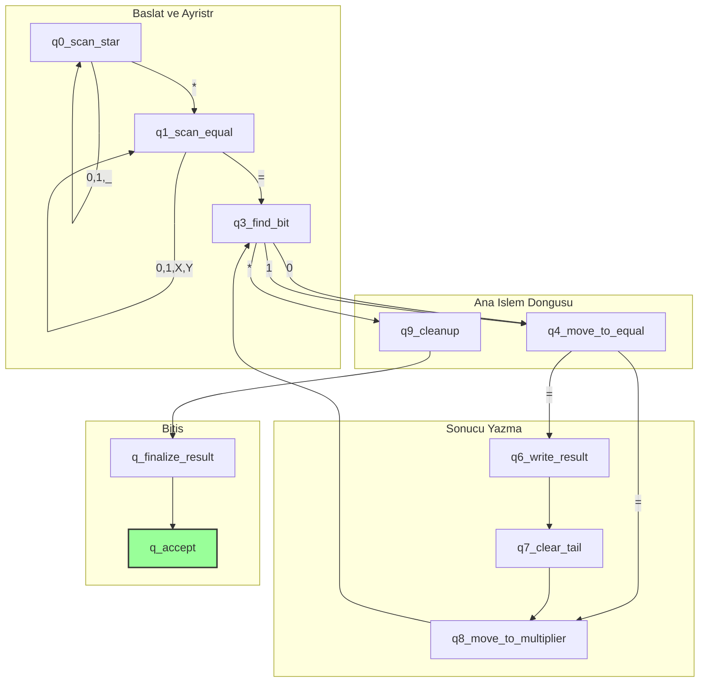

# Durum Gecis Diyagrami (Mermaid)

```mermaid
graph TD
    subgraph "Baslat ve Ayristr"
        q0_scan_star -- "0,1,_" --> q0_scan_star
        q0_scan_star -- "*" --> q1_scan_equal
        q1_scan_equal -- "0,1,X,Y" --> q1_scan_equal
        q1_scan_equal -- "=" --> q3_find_bit
    end

    subgraph "Ana Islem Dongusu"
        q3_find_bit -- "0" --> q4_move_to_equal
        q3_find_bit -- "1" --> q4_move_to_equal
        q3_find_bit -- "*" --> q9_cleanup
    end

    subgraph "Sonucu Yazma"
        q4_move_to_equal -- "=" --> q6_write_result
        q4_move_to_equal -- "=" --> q8_move_to_multiplier
        q6_write_result --> q7_clear_tail
        q7_clear_tail --> q8_move_to_multiplier
        q8_move_to_multiplier --> q3_find_bit
    end

    subgraph "Bitis"
        q9_cleanup --> q_finalize_result
        q_finalize_result --> q_accept
    end

    style q_accept fill:#9f9,stroke:#333,stroke-width:2px
```

Not: q4_move_to_equal durumunda, isaretlenen bit 1 ise q6_write_result, 0 ise q8_move_to_multiplier yoluna gidilir.
